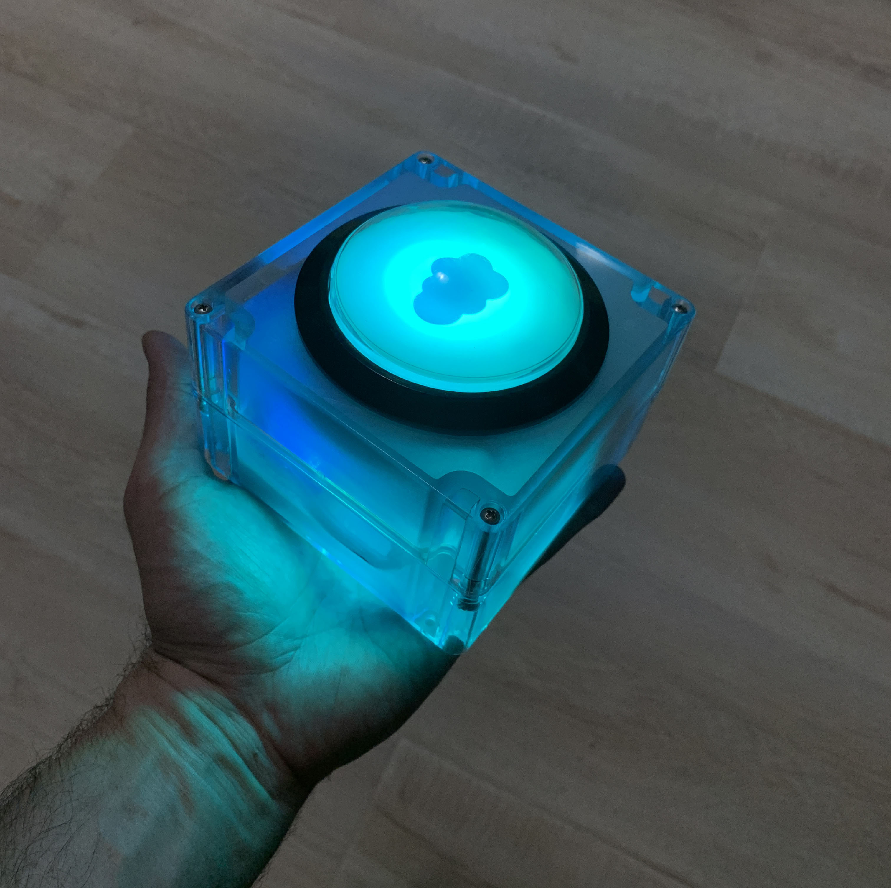
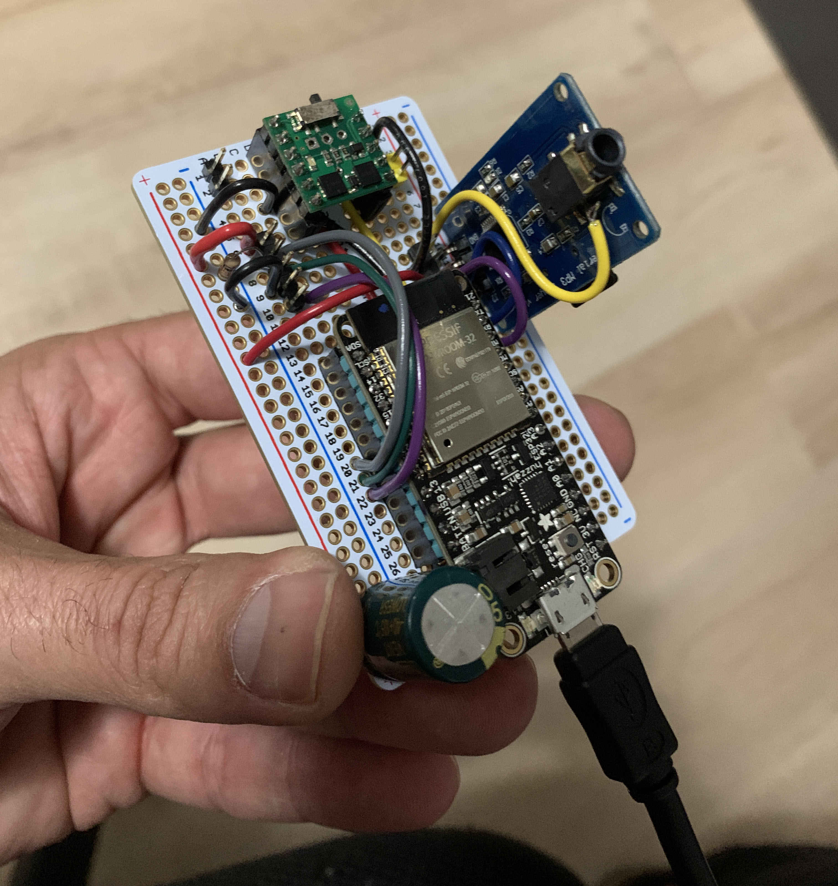
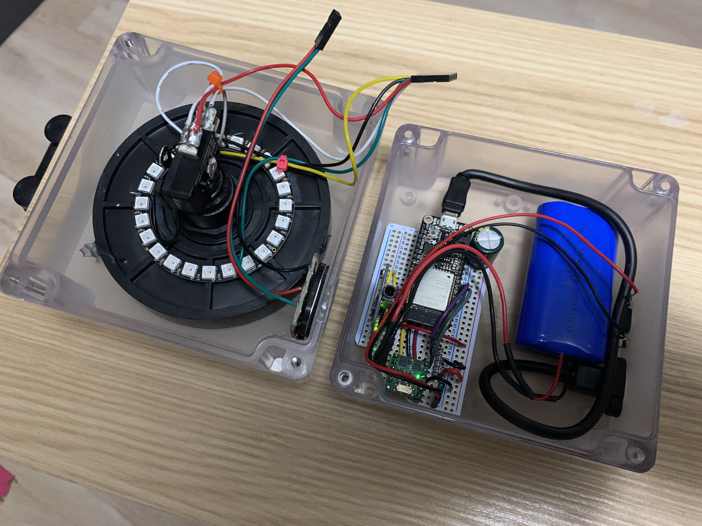
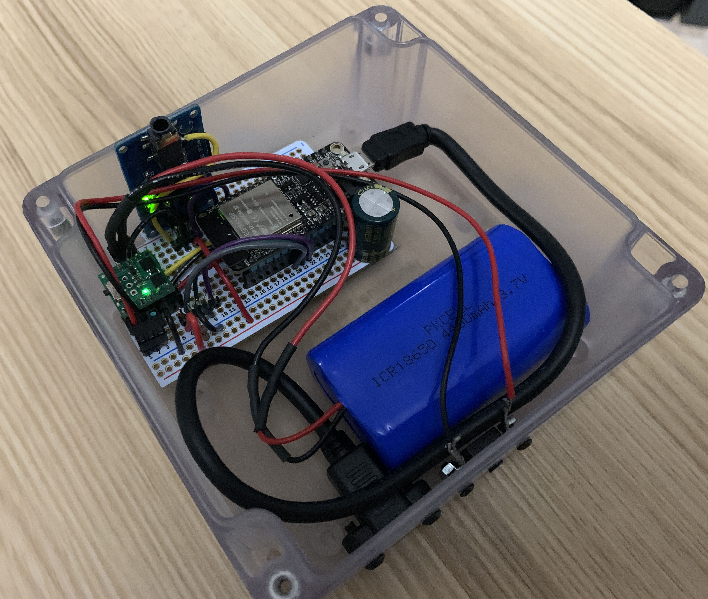

## Big Button
Welcome to your custom rework of an old idea. This button has some details you should know about. 

## Images
[Demo Video](Media/DemoVideo.mp4)

## Settings
To access the settings you will need to join the WiFi network hosted by the button. The network is **active for 10 mintues** after power up. After that, it is shut down to save batteries. Once on the network use a computer or mobile device to view the following URL.

* Network: **BigButton_xxxx**
* URL: **http://10.10.10.1**

Options:

* LED Patterns
* LED Brightness
* Audio Tracks
* Audio Volume

## Power and Charging
The power button is the round black dot on the side next to the USB port. Under normal conditions, the power button works as expected. When disconnecting from a power source, the device will say on for a few minutes even if the power button is in the off position. Pressing the button several times will use up any residual power. 

### That was easy!

Questions?  
[jandolina@salesforce.com](mailto:jandolina@salesforce.com)